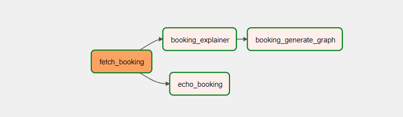
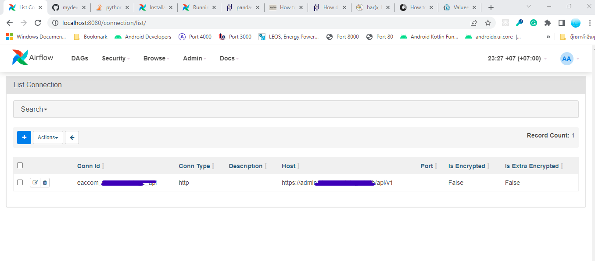
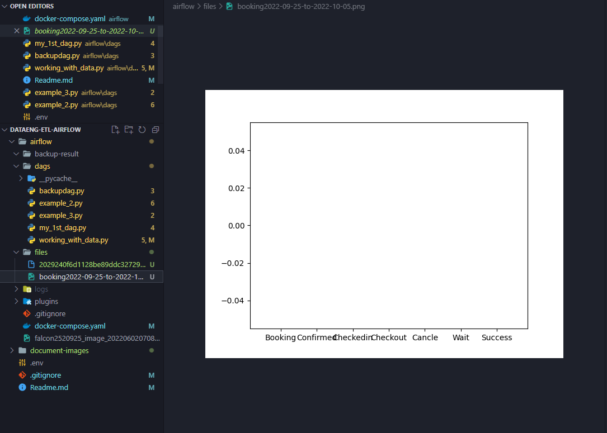

# Apache Airflow ETL Lab My Own Dags

240-513 Data Engineering
Original By Dr.Anant Choksuriwong



## แนวคิดหลักของ DAGs นี้

เป็นการทำตัวอย่างการเก็บรายการสถานะการจองห้องพัก โดยเข้าไป GET เข้าไปที่ API ระบบ E-Accom ที่ผมได้พัฒนาขั้นมา โดยเข้าไป GET รายการ Booking จากช่วง 5 วันย้อนหลัง และ 5 วันข้างหน้า จากนั้นนำมา Log ดูค่า พร้อมกันกับการ เอาไปประมวลผลแยกออกไปเป็นประเภทต่าง ๆ และนำข้อมูลไป Plot เป็นกราฟ ก่อนที่จะ Save ลงบนเครื่อง

ตั้งชื่อ Dags เป็น working_with_data และตั้งความถี่เป็น daily

## การดำเนินการในแต่ละขั้นตอน

- การปรับ Config ใน `docker-compose.yaml`
  มีการปรับให้มันรันโค้ดใน Library ของ Matplotlib ได้ จึงมีการใส่ matplotlib ลงเป็น Pip Additional requirements ใน Environment

  ```
    environment:
    &airflow-common-env
    ...
    AIRFLOW__API__AUTH_BACKENDS: 'airflow.api.auth.backend.basic_auth'
    _PIP_ADDITIONAL_REQUIREMENTS: ${_PIP_ADDITIONAL_REQUIREMENTS:- pandas matplotlib}
    ...
    volumes:
    - ./dags:/opt/airflow/dags
    - ./logs:/opt/airflow/logs
    - ./plugins:/opt/airflow/plugins
    - ./files:/tmp/images

  ```

  รวมถึงมีการ Bind โฟล์เดอร์ files ข้างนอกเข้าไปที่ `/tmp/images` ข้างในเพื่อให้เห็นภาพที่ออกมา

- **Fetch Booking** เป็น SimpleHttpOperator โดยสร้าง connecting ไว้ใน Connections ของระบบ รวมถึงใส่ Token ต่างๆ ไว้ใน Variable ด้วย

  

  โค้ดที่ใช้ใน Operation นี้

  ```
  fetch_booking = SimpleHttpOperator(
      task_id='fetch_booking',
      http_conn_id='eaccom_chaesonvintage_api',
      endpoint='/booking',
      headers={"Content-Type": "application/json",
               "Authorization": "Bearer "+Variable.get('api_token')},
      method='GET',
      data={
          "start": format_date(last_5_day_date()), "end": format_date(next_5_day_date())
      },
  )
  ```

- **Echo Booking** เป็นกระบวนการธรรมดา ที่จะ Log ออกมาให้เราได้เห็นว่า Booking ของเรามาแล้ว โดยจะเป็น Python Operation

- **Booking Explainer** เป็นกระบวนการกระจายข้อมูล โดยทั้ง Echo Booking และ Booking Explainer จะเป็นการใช้ข้อมูลที่เก็บไว้ใน XCom ของ id `fetch_booking` โดยจะเอามา load เป็นตัวแปรที่มีลักษณะเป็น JSON จากนั้นดึงสถานะ ออกมาจากรายการของมัน แล้วเอาสถานะนั้นเก็บเข้าไปใน Variable ชื่อ `booking_status_list`

- **Booking Generate Graph** เป็นกระบวนที่เป็น Python Operation จะเป็นการใช้ Matplotlib มาเกี่ยวข้อง เริ่มด้วยการเข้าไปนับจำนวนการจองที่เป็นสถานะต่างๆ อันได้แก่ จอง ยืนยันการจอง เช็คอิน เช็คเอาท์ ยกเลิก รอ เสร็จสิ้น แล้วจึงใช้ Matplotlib ทำออกมาเป็นกราฟ ในข้อมูลเก็บเป็นภาษาไทย แต่เนื่องจากเพื่อเมื่อ Export รูปภาพออกโดยมีอักษรภาษาไทย มันต้องมีการติดตั้งอะไรบางอย่าง จึงใช้ภาษาอังกฤษแทน การบันทึก Image ใช้เป็นการ Save ลงไปเป็นไฟล์โดยใช้ `plt.savefig()`

## ผลลัพธ์

ได้ภาพออกมาเป็นไฟล์ อยู่ใน Directory /files ตามที่ Bind ไว้กับตัวของ Docker Compose แต่ว่าผลที่ออกมา อาจจะไม่ถูกต้องนัก



## Define Dependencies

- `> >` : dependency one to one
- `> > [,,...]` : fn out one to multiple
  `> > my_tast >> [my_second_task,my_third_task]`
